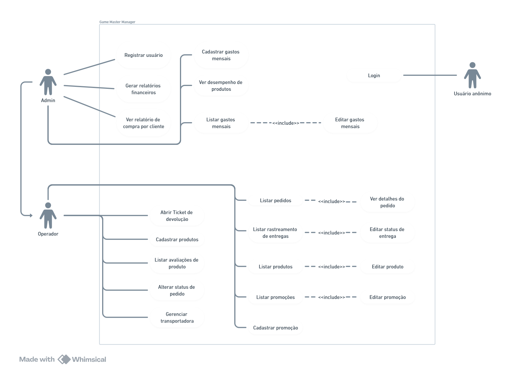
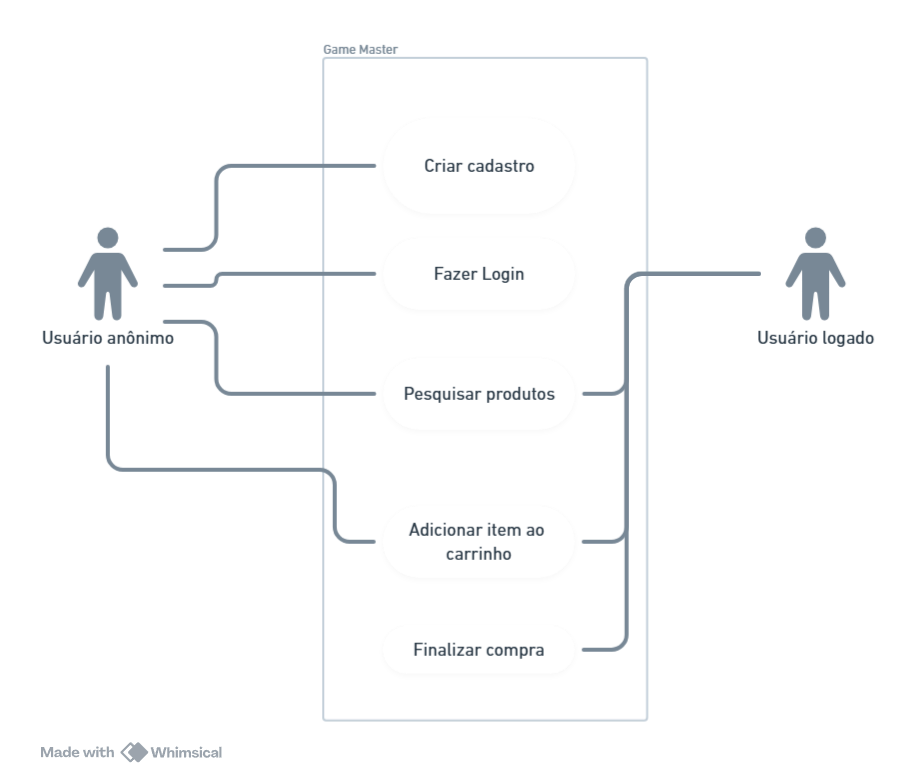

# 🎮 Game Master 🎮

## Sumário

1. [Descrição do projeto](#1-descrição-do-projeto)
2. [Documentação completa](#2-documentação-completa)
3. [Diagrama de caso de uso](#3-diagramas-de-caso-de-uso)
4. [Backend](./backend/README.md)
   - 4.1 [Arquitetura](#41-arquitetura)
   - 4.2 [Diagrama Entidade-Relacionamento](#42-diagrama-entidade-relacionamento)
5. Frontend
   - 5.1 [Game Master Manager](#51-game-master-manager)
6. [Ferramentas utilizadas](#6-ferramentas-utilizadas)
7. [Guia de implantação](#7-guia-de-implantação)
8. [Desenvolvedores](#8-desenvolvedores)

## 1. Descrição do projeto

**Game Master** é um e-commerce fictício cujo principal objetivo é comercializar produtos relacionados ao mundo dos games, incluindo jogos eletrônicos físicos, componentes de computador, consoles de mesa, consoles portáteis, periféricos de computador e outros itens associados.

## 2. Documentação completa

Este projeto conta com uma documentação detalhada, garantindo total clareza sobre o que está sendo desenvolvido e abrangendo todos os casos dentro da aplicação.
[Clique aqui](https://whimsical.com/game-master-documento-de-requisitos-E2h8HHX9cGiiZiPMb5tu6V) para acessá-la.

## 3 Diagramas de caso de uso

A seguir estão os diagramas de caso de uso:



## 4.1 Arquitetura

A arquitetura escolhida para desenvolver esse projeto foi Clean Arch. Veja assim a estrutura do projeto:

```
io.github.lucasfrancobn.gamemaster
├── application
│   ├── gateway
│   ├── shared.pagination
│   └── usecase
├── domain
│   ├── entities
│   └── services
├── infra
│   ├── config
│   │   ├── bean
│   │   ├── scheduler
│   │   └── security
│   │       ├── authentication
│   │       ├── filter
│   │       ├── repository
│   │       ├── server
│   │       └── service
│   └── web
├── controller
├── gateway
├── persistence
│   ├── model
│   └── repository
├── presentation
│   ├── dtos
│   └── mappers
└── service
```

## 4.2 Diagrama Entidade-Relacionamento

A imagem a seguir representa toda a estrutura do banco de dados:


## 5.1 Game Master Manager

Game Master Manager é o sistema de gerenciamento do Ecommerce a ser desenvolvido. Nele, é possível controlar todas as operações do ecommerce, como gerenciar produtos, pedidos, promoções, usuários e acessos, transporte, entre muitas outras funcionalidades.
Todo o sistema foi desenvolvido utilizando Angular. Veja a descrição completa do projeto [clicando aqui](./manager/README.md)

## 6. Ferramentas utilizadas

<div style="display: flex; gap: 15px">
<a href="https://www.java.com" target="_blank"> 
     
</a>

<a href="https://spring.io/" target="_blank"> 
     
</a>

<a href="https://www.postman.com/" target="_blank"> 
     
</a>

<a href="https://www.postgresql.org/" target="_blank">
    
</a>

<a href="https://www.docker.com/" target="_blank">
    
</a>

<a href="https://angular.dev/" target="_blank">
    
</a>

<a href="https://ng.ant.design/docs/introduce/en" target="_blank"> 
     
</a>

</div>

## 7. Guia de implantação

### 🚧 Projeto ainda em construção 🚧

O projeto ainda está em construção, mas você pode testar o que já foi desenvolvido até então.
Lista de funcionalidades desenvolvidas:

- [x] Autenticação com Login e Senha utilizando Authorization Flow do protocolo OAuth2.
- [x] Gerenciamento de Usuários.
- [x] Gerenciamento de Clients.
- [x] Gerenciamento de Produtos.

Antes de iniciar o projeto, precisamos do [Docker](https://www.docker.com/) e [Git](https://git-scm.com/) instalados em nossas máquinas.
Tendo o git instlado, rode o seguinte comando no terminal da sua máquina:

```bash
git clone https://github.com/LucasFrancoBN/game-master.git
```

Após isso, rode o seguinte comando no diretório raiz do projeto (somente se tiver o docker instalado em sua máquina):

```bash
docker-compose up
```

## 8. Desenvolvedores

<table align="center">
  <tr>
    <td align="center">
      <div>
        <br>
          <b> Lucas Franco   </b><br>
            <a href="https://www.linkedin.com/in/lucas-franco-barbosa-navarro-a51937221/" alt="Linkedin"></a>
            <a href="https://github.com/LucasFrancoBN" alt="Github"></a>
      </div>
    </td>
  </tr>
</table>
