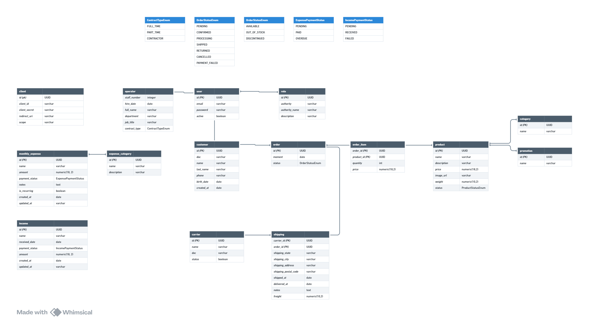

# 🎮 Game Master 🎮

<div align="center">
 <h2> Sumário</h2>
  <a href="#descrição-do-projeto">Descrição do projeto</a> -
  <a href="#documentação-completa">Documentação completa</a> -
  <a href="#arquitetura">Arquitetura</a> - 
  <a href="#diagrama-entidade-relacionamento">Diagrama Entidade-relacionamento</a> -
  <a href="#diagramas-de-caso-de-uso">Diagrama de caso de uso</a> -
  <a href="#guia-de-implantação">Guia de implantação</a> -
  <a href="#desenvolvedores">Desenvolvedores</a>
</div>

## Descrição do projeto

**Game Master** é um e-commerce fictício cujo principal objetivo é comercializar produtos relacionados ao mundo dos games, incluindo jogos eletrônicos físicos, componentes de computador, consoles de mesa, consoles portáteis, periféricos de computador e outros itens associados.

## Documentação completa
Este projeto conta com uma documentação detalhada, garantindo total clareza sobre o que está sendo desenvolvido e abrangendo todos os casos dentro da aplicação.
[Clique aqui](https://whimsical.com/game-master-documento-de-requisitos-E2h8HHX9cGiiZiPMb5tu6V) para acessá-la.

## Arquitetura
A arquitetura escolhida para desenvolver esse projeto foi Clean Arch. Veja assim a estrutura do projeto:

```
io.github.lucasfrancobn.gamemaster
├── application
│   ├── gateway
│   ├── shared.pagination
│   └── usecase
├── domain
│   ├── entities
│   └── services
├── infra
│   ├── config
│   │   ├── bean
│   │   └── security
│   │       ├── authentication
│   │       ├── filter
│   │       ├── repository
│   │       ├── server
│   │       └── service
│   └── web
├── controller
├── gateway
├── persistence
│   ├── model
│   └── repository
└── presentation
    ├── dtos
    └── mappers
```

## Diagrama Entidade-Relacionamento
A imagem a seguir representa toda a estrutura do banco de dados:



## Diagramas de caso de uso
A Seguir estão os diagramas de caso de uso:


## Ferramentas utilizadas
<div style="display: flex; gap: 15px">
<a href="https://www.java.com" target="_blank"> 
     
</a>

<a href="https://spring.io/" target="_blank"> 
     
</a>

<a href="https://www.postman.com/" target="_blank"> 
     
</a>

<a href="https://www.postgresql.org/" target="_blank">
    
</a>

<a href="https://www.docker.com/" target="_blank">
    
</a>

</div>

## Guia de implantação
### 🚧 Projeto ainda em construção 🚧
O projeto ainda está em construção, mas você pode testar o que já foi desenvolvido até então.
Lista de funcionalidades desenvolvidas:
- [x] Autenticação com Login e Senha utilizando Authorization Flow do protocolo OAuth2.
- [x] CRUD de Usuários.
- [x] CRUD de Clients

Antes de iniciar o projeto, precisamos do [Docker](https://www.docker.com/) e [Git](https://git-scm.com/) instalados em nossas máquinas.
Tendo o git instlado, rode o seguinte comando no terminal da sua máquina:
``` bash
git clone https://github.com/LucasFrancoBN/game-master.git
```
Após isso, rode o seguinte comando no diretório raiz do projeto (somente se tiver o docker instalado em sua máquina):
``` bash
docker-compose up
```

## Desenvolvedores
<table align="center">
  <tr>
    <td align="center">
      <div>
        <br>
          <b> Lucas Franco   </b><br>
            <a href="https://www.linkedin.com/in/lucas-franco-barbosa-navarro-a51937221/" alt="Linkedin"></a>
            <a href="https://github.com/LucasFrancoBN" alt="Github"></a>
      </div>
    </td>
  </tr>
</table>