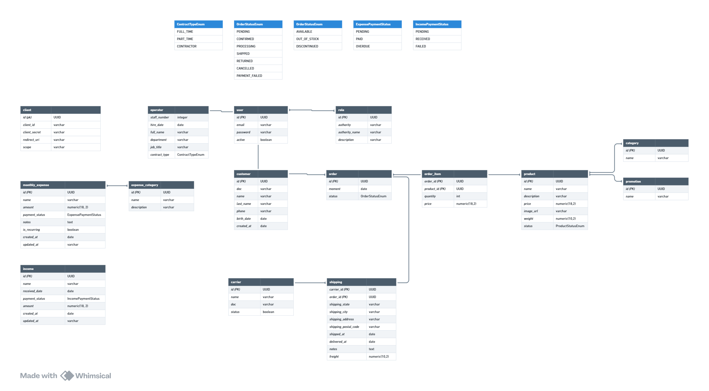

# Game Master - Backend

## Sumário

1. [Descrição do projeto](#1-descrição-do-projeto)
2. [Segurança](#2-segurança)
3. [Arquitetura](#3-arquitetura)
4. [Diagrama Entidade-Relacionamento](#4-diagrama-entidade-relacionamento)
5. [Funcionalidades Desenvolvidas](#5-funcionalidades-desenvolvidas)
6. [Desenvolvedores](#6-desenvolvedores)

## 1. Descrição do projeto

O backend do Game Master é responsável por toda a lógica de negócio da aplicação. Ele realiza a validação e persistência dos dados, garantindo a integridade e segurança das informações armazenadas no banco de dados.

## 2. Segurança

A aplicação implementa o fluxo de autorização mais seguro dentro do protocolo OAuth2: o Authorization Code Flow. Esse fluxo garante a autenticidade do usuário, pois a autenticação é realizada diretamente pelo Authorization Server, assegurando um sistema robusto e seguro para controle de acesso.

### Principais recursos

- Authorization Code Flow para autenticação segura.
- Controle de acesso baseado em permissões por usuário.
- Cadastro e gerenciamento de múltiplos Clients, permitindo que diferentes aplicações se autentiquem e acessem apenas os recursos autorizados.
- Implementação do Refresh Token, garantindo sessões mais longas sem necessidade de novo login.
- Suporte a Basic Authentication para integração com outras APIs.

Com essa abordagem, o backend mantém um nível elevado de segurança e flexibilidade, permitindo um gerenciamento eficaz de autenticação e autorização dentro da aplicação.

## 3. Arquitetura

O sistema foi desenvolvido seguindo os princípios da Clean Architecture, garantindo uma estrutura modular, escalável e de fácil manutenção. Essa abordagem foi escolhida para proporcionar os seguintes benefícios:

- **Separação de responsabilidades** – organização clara entre camadas.
- **Facilidade de manutenção e evolução** – código mais compreensível e adaptável.
- **Reutilização de código** – componentes desacoplados e reaproveitáveis.
- **Testabilidade aprimorada** – código preparado para testes automatizados.
- **Baixo acoplamento e alta coesão** – módulos independentes e bem estruturados.
- **Independência de frameworks** – flexibilidade para mudanças tecnológicas.

Além disso, a aplicação segue as boas práticas do Clean Code e os princípios SOLID, garantindo um código mais limpo, legível e sustentável a longo prazo.

Segue o modelo da arquitetura:

```
io.github.lucasfrancobn.gamemaster
├── application
│   ├── gateway
│   ├── shared.pagination
│   └── usecase
├── domain
│   ├── entities
│   └── services
├── infra
│   ├── config
│   │   ├── bean
│   │   ├── scheduler
│   │   └── security
│   │       ├── authentication
│   │       ├── filter
│   │       ├── repository
│   │       ├── server
│   │       └── service
│   └── web
├── controller
├── gateway
├── persistence
│   ├── model
│   └── repository
├── presentation
│   ├── dtos
│   └── mappers
└── service
```

## 4. Diagrama Entidade-Relacionamento

Seguindo exatamente as necessidades dos usuários da aplicação, esse foi o Diagrama de Entidade-Relacionamento gerado antes do início da aplicação:



## 5. Funcionalidades Desenvolvidas

Lista de funcionalidades desenvolvidas:

- [x] Autenticação com Login e Senha utilizando Authorization Flow do protocolo OAuth2.
- [x] Gerenciamento de Usuários.
- [x] Gerenciamento de Clients.
- [x] Gerenciamento de produto.
- [x] Tarefa agendada para excluir todos as imagens orfãs do sistema.

## 6. Desenvolvedores

<table align="center">
  <tr>
    <td align="center">
      <div>
        <br>
          <b> Lucas Franco   </b><br>
            <a href="https://www.linkedin.com/in/lucas-franco-barbosa-navarro-a51937221/" alt="Linkedin"></a>
            <a href="https://github.com/LucasFrancoBN" alt="Github"></a>
      </div>
    </td>
  </tr>
</table>
