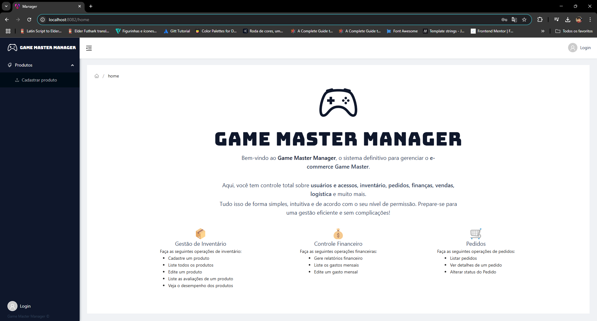

# Game Master Manager

## Sumário

1. [Descrição do projeto](#1-descrição-do-projeto)
2. [Arquitetura](#2-arquitetura)
3. [Ferramentas utilizadas](#3-ferramentas-utilizadas)
4. [Interface](#4-interface)
   - 4.1 [Elementos principais](#41-elementos-principais)
5. [Funcionalidades desenvolvidas](#5-funcionalidades-desenvolvidas)
6. [Desenvolvedores](#6-desenvolvedores)

## 1. Descrição do projeto

Game Master Manager é o sistema gerenciador do Ecommerce, mas além disso, ele vem com diversas outras funcionalidades para auxiliar o comércio, como toda a gestão de usuário e financeira também.

## 2. Arquitetura

Para esse sistema, foi usada a arquitetura baseada em funcionalidades (**Feature Module Architecture**), garantindo uma estrutura modular, escalável e de fácil manutenção. Essa abordagem foi escolhida para proporcionar os seguintes benefícios:

- **Separação de responsabilidades** – organização clara entre módulos de funcionalidades.
- **Facilidade de manutenção e evolução** – cada funcionalidade é isolada, facilitando atualizações.
- **Reutilização de código** – componentes e serviços organizados por domínio e reaproveitáveis.
- **Testabilidade aprimorada** – módulos independentes, facilitando a escrita de testes automatizados.
- **Baixo acoplamento e alta coesão** – cada módulo gerencia sua própria lógica sem impactar outros.
- **Otimização de performance com Lazy Loading** – carregamento sob demanda das funcionalidades necessárias.  


Segue o modelo da arquitetura:

```
src
├───app
│   │
│   ├───core
│   │   ├───interceptors
│   │   ├───models
│   │   └───services
│   │
│   ├───features
│   │   └───product
│   │       ├───models
│   │       ├───pages
│   │       │   └───cadastrar-produto
│   │       ├───service
│   │       └───utils
│   │
│   └───shared
│       ├───components
│       └───utils
│
└───environments
        environment.development.ts
        environment.ts
```

## 3. Ferramentas utilizadas

Para o desenvolvimento da aplicação, foram utilizadas as seguintes tecnologias:

- Angular 19.
- Ng Zorro

<div style="display: flex; gap: 15px">
<a href="https://angular.dev/" target="_blank"> 
     
</a>

<a href="https://ng.ant.design/docs/introduce/en" target="_blank"> 
     
</a>

</div>

## 4. Interface

Para demonstrar o sistema, esta é a tela inicial, que também representa sua interface principal.


Vale a pena destacar os seguintes pontos:

### 4.1 Elementos Principais

A interface é dividida em três seções principais:

1. Barra lateral de navegação (Menu à esquerda):
   - Contém links para as funcionalidades essenciais, como Produtos e Cadastro de Produto.
   - Oferece um menu expansível para futuras categorias e melhorias na navegação.
   - Inclui um botão de Login, indicando que o sistema possui controle de acesso.
2. Área central (Conteúdo principal):
   - Esta é a área onde todo o conteúdo das páginas será exibido, incluindo formulários, dados, gráficos e outras informações relevantes.
   - Exibe a identidade visual do sistema, com o nome Game Master Manager e uma breve descrição sobre suas funcionalidades.
   - Destaca os principais módulos do sistema (Gestão de Inventário, Controle Financeiro e Pedidos) com ícones e descrições curtas, facilitando a compreensão do usuário.
3. Cabeçalho:
   - Possui um ícone de menu para ocultar ou expandir a barra lateral, melhorando a experiência em diferentes tamanhos de tela.
   - Apresenta um botão de Login no canto superior direito, reforçando o controle de acesso ao sistema.

## 5. Funcionalidades Desenvolvidas

Lista de funcionalidades desenvolvidas:

- [x] Autenticação com Login e Senha utilizando Authorization Flow do protocolo OAuth2.
- [x] Gerenciamento de produto.

## 6. Desenvolvedores

<table align="center">
  <tr>
    <td align="center">
      <div>
        <br>
          <b> Lucas Franco   </b><br>
            <a href="https://www.linkedin.com/in/lucas-franco-barbosa-navarro-a51937221/" alt="Linkedin"></a>
            <a href="https://github.com/LucasFrancoBN" alt="Github"></a>
      </div>
    </td>
  </tr>
</table>
